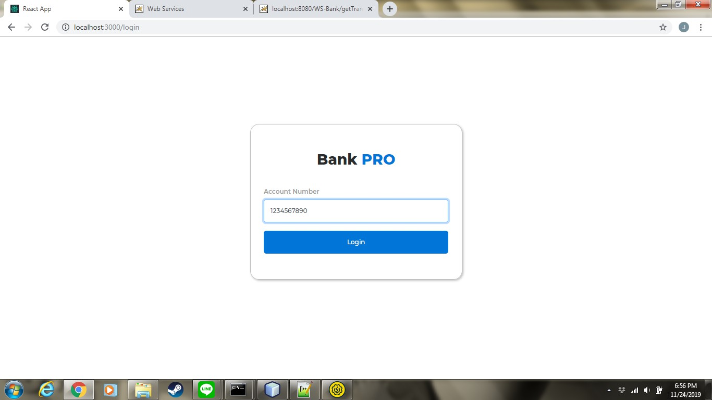
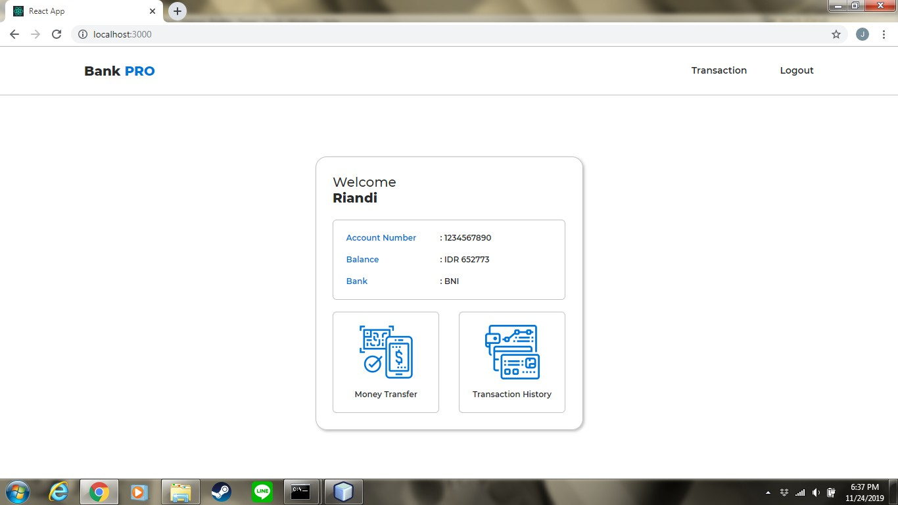
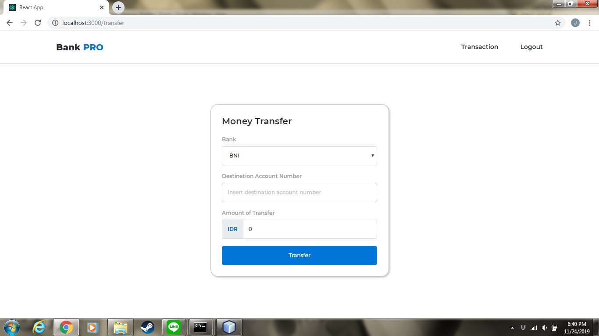
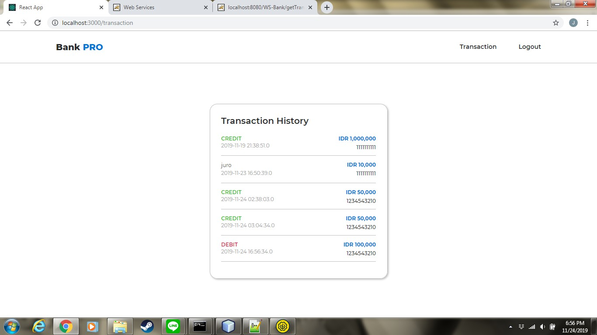

# Bank Pro

## Deskripsi Aplikasi Bank
Aplikasi Bank Pro merupakan aplikasi yang dibangun dengan menggunakan ReactJS untuk melakukan transaksi bagi para nasabah Bank Pro. Pada aplikasi ini, nasabah dapat masuk dengan memasukkan nomor rekening yang dimiliki. Pada halaman utama, pengguna dapat melihat ringkasan rekening berupa nama pemilik, nama bank, nomor rekening, dan saldo yang terdapat pada rekening. Dengan menggunakan aplikasi ini, pengguna dapat melakukan transfer ke rekening lain dan melihat riwayat transaksi yang dilakukan.

## Screenshot Aplikasi Bank

 
 

 
 

 
 

 
 

## Praktik Pengembangan Perangkat Lunak
1.  Gitflow Workflow: 13517044, 13517080, 13517113
2.  Eksplorasi dan setup mesin deployment: 13517044, 13517080, 13517113
3.  CI/CD : 13517113
4.  Unit Testing: 13517080

## URL AWS
ec2-54-92-160-89.compute-1.amazonaws.com:3000
